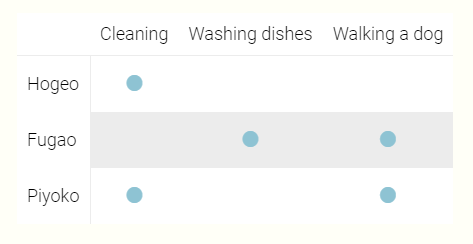

# hexo-plugin-attribution-table

## Setup

Insert `attribution.js` file to your `scripts/` folder of the hexo project.
Instructions on `scripts/` folder is found in the [Hexo Documentation](https://hexo.io/docs/plugins.html).

## How to use

You can embed a gallery between `` and `` tag in a post or page.

## Example

```

{
  "columns": ["Cleaning", "Washing dishes", "Walking a dog"],
  "members": {
    "Hogeo": [ "Cleaning" ],
    "Fugao": ["Washing dishes", "Walking a dog"],
    "Piyoko": ["Cleaning", "Walking a dog"]
  }
}

```


