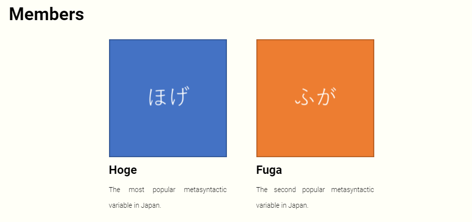

# hexo-plugin-gallery

## Setup

Insert `gallery.js` file to your `scripts/` folder of the hexo project.
Instructions on `scripts/` folder is found in the [Hexo Documentation](https://hexo.io/docs/plugins.html).

## How to use

You can embed a gallery between `` and `` tag in a post or page.


## Example

```markdown
## Members


[
  {
    "path": "images/hoge.png",
    "name": "Hoge",
    "comment": "The most popular metasyntactic variable in Japan."
  },
  {
    "path": "images/fuga.png",
    "name": "Fuga",
    "comment": "The second popular metasyntactic variable in Japan."
  }
]

```


